# Communication Barriers in South African Healthcare

## Evidence from Dr George Mukhari Academic Hospital and the National Context

| | |
| --- | --- |
| **Document type** | Research brief |
| **Prepared for** | HealthCom |
| **Focus site** | Dr George Mukhari Academic Hospital (DGMAH), Pretoria |
| **Last updated** | September 2026 |

## Executive summary

> **One-page brief for hospital leadership, DoH stakeholders, and HealthCom pitches.**

South African public hospitals routinely fail a basic safety requirement: patients leave encounters without understanding their care, and often without asking a single clarifying question.

**Local proof.** At Dr George Mukhari Academic Hospital (DGMAH), Mabuza et al. (2014) analysed 152 inpatients who had received information they did not understand, yet still did not seek clarity. Patients described clinicians as “too busy” or aloof, feared judgement or bad news, and often assumed doctors “already know best.”

**National pattern.** South Africa has twelve official languages, but clinical exchange still leans on English and Afrikaans. Formal interpreters are scarce. Wards rely on ad-hoc translators (nurses, relatives, even porters), creating distortion, confidentiality breaches, and false reassurance when patients nod without understanding.

**Second barrier.** Even when language is shared, unexplained medical jargon alienates patients and drives avoidance: missed follow-ups, poor adherence, and later, costlier disease presentation.

**Why hospitals should care.** Communication failure is not only a patient-experience issue. It pulls nurses off clinical duties, wastes doctor time on rework and complications, and weakens informed consent, raising ethical and malpractice exposure.

**HealthCom implication.** The evidence calls for tools and workflows that (1) explain in the patient’s preferred language, (2) make asking safe and low-friction, and (3) verify comprehension, so understanding is measured, not assumed.

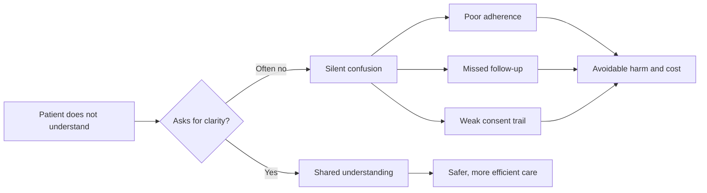

**Bottom line:** Silence is not agreement. DGMAH shows why; the national language gap shows how widespread the risk is; HealthCom is positioned to close that gap.

## Abstract

Patients in South African public hospitals frequently leave clinical encounters without understanding their diagnosis, treatment plan, or medication instructions, and often without asking for clarification. Qualitative research at Dr George Mukhari Academic Hospital (DGMAH) shows that inpatients withhold questions because they perceive clinicians as too busy or aloof, fear judgement, or lack confidence to speak up. These local findings mirror a national pattern: South Africa has twelve official languages, yet care is delivered largely in English and Afrikaans through ad-hoc, untrained interpreters. The result is compromised understanding, confidentiality risks, wasted clinical time, poorer adherence, and increased liability. This brief synthesises the DGMAH evidence with national literature on language and jargon barriers, and outlines why structured communication support, such as that proposed by HealthCom, is clinically and operationally necessary.

## 1. Introduction

Effective two-way communication between healthcare practitioners and patients is foundational to informed consent, adherence, and safe care. South African law and professional ethics require that patients understand their clinical condition and proposed management. In practice, that standard is often unmet.

This brief addresses three interrelated problems:

1. **Silence under pressure** — patients who do not understand still do not ask.
2. **Language mismatch** — multilingual patients served by a largely monolingual clinical system.
3. **Jargon as a second barrier** — even shared-language encounters can fail when clinical terminology is unexplained.

Together, these barriers drive avoidance behaviour, inefficient ward workflows, and avoidable clinical and legal risk.

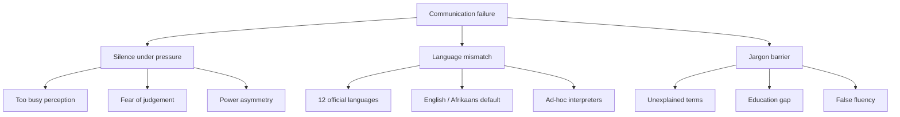

## 2. Anchor study: DGMAH, Pretoria

### 2.1 Study overview

The primary local evidence base is the qualitative work of **Mabuza et al. (2014)** at Dr George Mukhari Academic Hospital:

> *Reasons for inpatients not to seek clarity at Dr George Mukhari Academic Hospital, Pretoria*  
> *African Journal of Primary Health Care & Family Medicine*, 6(1), a576.  
> [https://doi.org/10.4102/phcfm.v6i1.576](https://doi.org/10.4102/phcfm.v6i1.576)

This study was the qualitative arm of a larger 2010 survey of 264 inpatients on awareness of admission reasons and management plans (Mabuza et al., 2015). From that cohort, researchers analysed unstructured responses from **152 patients** who reported that they had received information they did not understand, yet still did not seek clarity.

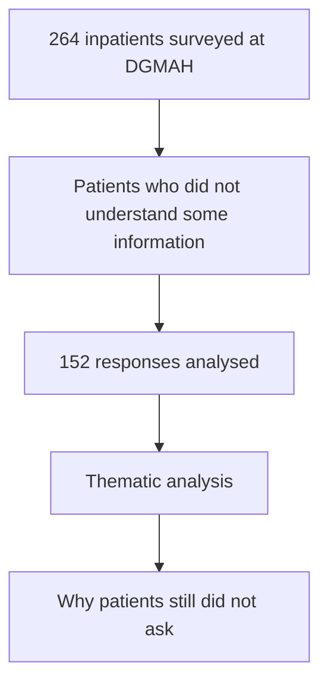

### 2.2 Key findings

| Theme | What patients reported |
| --- | --- |
| **Time pressure / intimidation** | Practitioners seemed “too busy,” aloof, or poor communicators, especially during fast-moving encounters such as ward rounds. |
| **Fear and self-perception** | Patients feared bad news, felt held in low esteem, or believed their questions would be unwelcome. |
| **Unquestioning trust** | Some patients assumed clinicians “already know best” and therefore did not probe incomplete explanations. |
| **Prior experience** | Bad prior treatment discouraged further questions. |

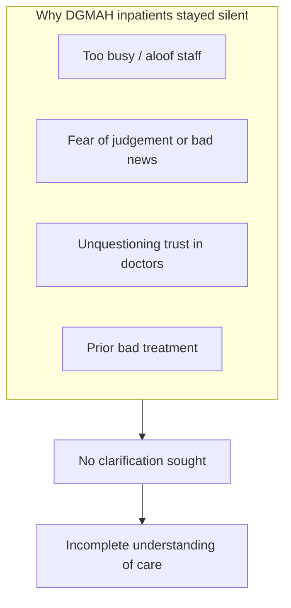

A companion quantitative finding strengthens the case: a large share of inpatients lacked awareness of key aspects of their care, and many did not request information even when it was not volunteered (Mabuza et al., 2015). Reluctance to “trouble” busy staff is a recurring theme in the literature.

### 2.3 Why this matters for HealthCom

DGMAH demonstrates that **non-understanding is not always a language problem alone**. Power asymmetry, pace of care, and fear of judgement suppress questions even when a shared language exists. Any intervention must therefore:

- lower the social cost of asking;
- check comprehension, not only deliver information; and
- work within real ward time constraints.

## 3. National scale: language vs healthcare delivery

The DGMAH pattern is a microcosm of a nationwide structural problem. South Africa recognises **twelve official languages**, yet public healthcare continues to rely heavily on English and Afrikaans for clinical exchange.

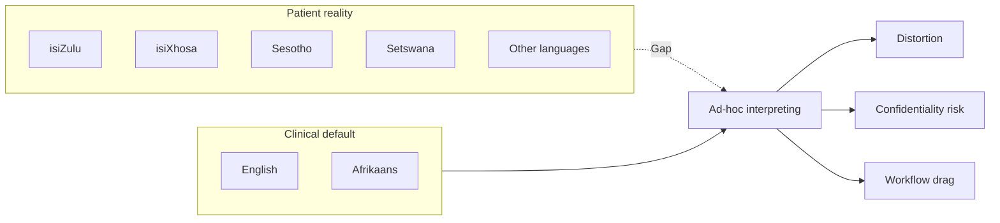

### 3.1 Ad-hoc interpreting as the default

Across South African facilities, formal interpreting services are scarce. Clinicians routinely bridge language gaps with:

- untrained, overworked nurses;
- family members (including, in some cases, minors);
- porters, cleaners, or other patients.

This practice is well documented in primary care and hospital settings (Anthonissen, 2013; Hussey, 2012; Theys & Kilian, 2023).

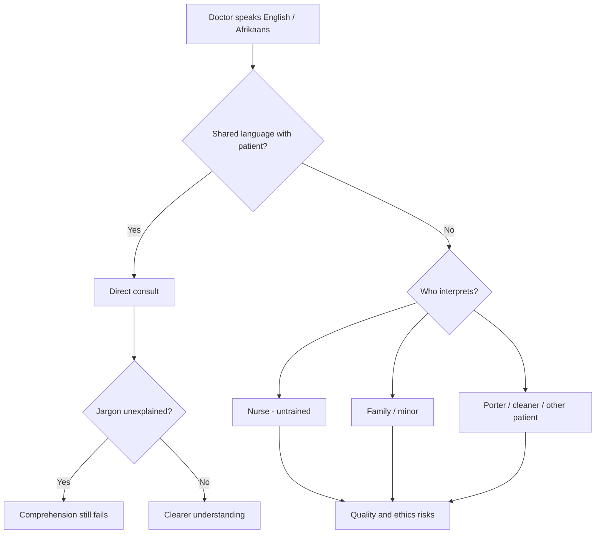

### 3.2 Consequences of ad-hoc interpreting

| Risk | Clinical / operational effect |
| --- | --- |
| **Distortion and omission** | Untrained interpreters alter or drop medically important detail. |
| **Confidentiality breaches** | Sensitive information is shared with relatives or non-clinical staff. |
| **Workflow drag** | Nurses are pulled from clinical duties to translate, reducing ward capacity. |
| **False reassurance** | Patients may appear to understand after a brief translation when comprehension was never verified. |

### 3.3 The “nod and smile” risk

A critical safety hazard in limited-English-proficiency encounters is **acquiescence**: patients nod or say “yes” to complex instructions rather than admit they do not understand. Without teach-back or another comprehension check, clinicians may document consent and discharge advice that the patient cannot actually follow.

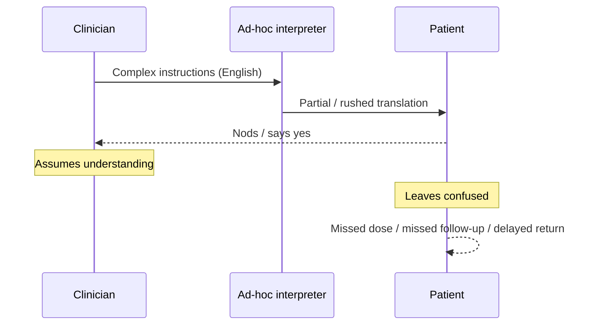

## 4. The medical jargon barrier

Language mismatch is not the only communication failure. Even when doctor and patient share a language, **clinical terminology** creates a secondary barrier.

### 4.1 Unconscious jargon use

Health professionals frequently use technical terms without noticing. For patients with limited formal education, or those encountering hospital culture for the first time, this produces a near-complete disconnect between what was said and what was understood.

### 4.2 Avoidance and delayed care

Miscommunication driven by language *and* jargon contributes to **patient avoidance behaviour**:

- lower likelihood of returning for follow-up;
- poorer medication adherence;
- later presentation of disease, when treatment is harder and more expensive.

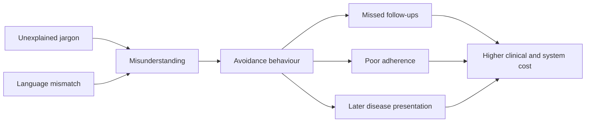

In short, poorly understood encounters do not only fail in the moment. They reshape care-seeking over time.

## 5. Operational and business impact

For hospital administrators and the Department of Health, communication failure is not only a quality-of-care issue. It is a cost, capacity, and risk issue.

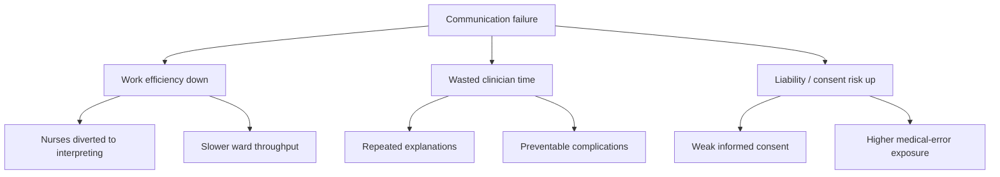

### 5.1 Decreased work efficiency

Using nurses as unofficial interpreters removes them from clinical tasks and slows ward throughput. Finding willing staff who speak the patient’s language becomes part of the consult, not an exception.

### 5.2 Wasted clinician time

Doctors spend additional time repeating instructions, clarifying confusion, or managing complications that arise because a patient did not understand dosing, warning signs, or follow-up requirements.

### 5.3 Malpractice, ethics, and informed consent

Miscommunication is a recognised contributor to medical error and compromised informed consent. Facilities that cannot demonstrate that patients understood material information face elevated clinical, ethical, and legal exposure.

### 5.4 Value proposition for structured support (HealthCom)

A tool or workflow that helps patients understand instructions in their preferred language, invites questions safely, and verifies comprehension can:

- reduce reliance on ad-hoc interpreters for routine explanation;
- free nursing time for clinical care;
- improve adherence and reduce avoidable readmissions or late presentations;
- strengthen the documentation trail for informed consent and discharge counselling.

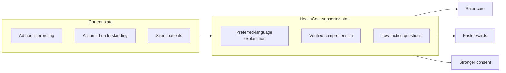

## 6. Synthesis: problem to product implication

| Evidence theme | Implication for HealthCom |
| --- | --- |
| Patients do not ask, even when confused (DGMAH) | Design low-friction clarification and teach-back flows; do not assume questions will be voiced. |
| Ad-hoc interpreting is the national default | Support multilingual plain-language explanation without depending on busy ward staff. |
| Nodding is not understanding | Build explicit comprehension checks into the product. |
| Jargon alienates even same-language patients | Prefer plain language; explain clinical terms by default. |
| Interpreting drains nursing capacity | Position the product as a ward-efficiency intervention, not only a patient-experience feature. |
| Miscommunication raises liability | Frame outcomes in terms of consent quality, safety, and reduced error risk. |

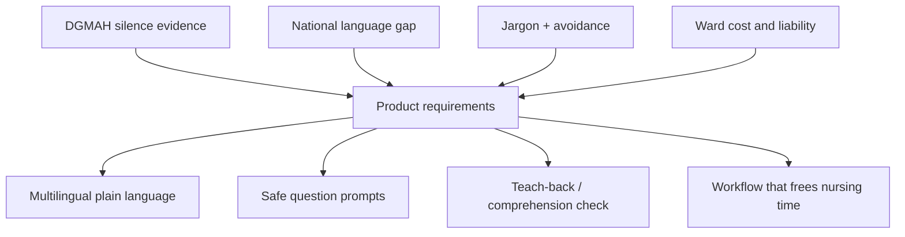

## 7. Conclusion

Research at Dr George Mukhari Academic Hospital shows that inpatients often fail to seek clarity when they do not understand their care. That silence is shaped by perceived clinician busyness, fear of judgement, and unequal power in the clinical encounter. Nationally, the same vulnerability is amplified by South Africa’s language mismatch and by dependence on untrained interpreters. Medical jargon adds a further barrier even where language is shared.

These findings establish a clear need for interventions that make understanding measurable and questions safe, not optional. For HealthCom, the research case is therefore both clinical and operational: better communication is safer care, more efficient wards, and lower institutional risk.

## References

1. Anthonissen, C. (2013). *Providing truly patient-centred care: Harnessing the pragmatic power of interpreters*. Stellenbosch Papers in Linguistics Plus, 43. [https://doi.org/10.5842/43-0-214](https://doi.org/10.5842/43-0-214)

2. Hussey, N. (2012). *Providing health care interpreting in the Department of Radiation Oncology, Charlotte Maxeke Johannesburg Academic Hospital* [Master’s research report, University of the Witwatersrand]. [http://hdl.handle.net/10539/14812](http://hdl.handle.net/10539/14812)

3. Mabuza, L. H., Omole, O. B., Govender, I., & Ndimande, J. V. (2014). Reasons for inpatients not to seek clarity at Dr George Mukhari Academic Hospital, Pretoria. *African Journal of Primary Health Care & Family Medicine*, 6(1), a576. [https://doi.org/10.4102/phcfm.v6i1.576](https://doi.org/10.4102/phcfm.v6i1.576)

4. Mabuza, L. H., Omole, O. B., Govender, I., Ndimande, J. V., & Ogunbanjo, G. A. (2015). Inpatients’ awareness of admission reasons and management plans of their clinical conditions at a tertiary hospital in South Africa. *BMC Health Services Research*, 15, 92. [https://doi.org/10.1186/s12913-015-0754-y](https://doi.org/10.1186/s12913-015-0754-y)

5. Schlemmer, A., & Mash, B. (2006). The effects of a language barrier in a South African district hospital. *South African Medical Journal*, 96(10), 1084–1087.

6. Theys, C., & Kilian, S. (2023). Do not lose your patient in translation: Using interpreters effectively in primary care. *South African Family Practice*, 65(1), a5655. [https://doi.org/10.4102/safp.v65i1.5655](https://doi.org/10.4102/safp.v65i1.5655)

7. Levin, M. (2006). Language as a barrier to care for Xhosa-speaking patients at a South African paediatric teaching hospital. *South African Medical Journal*, 96(10), 1076–1079.

## Appendix A: Suggested citation for this brief

> HealthCom Research. (2026). *Communication barriers in South African healthcare: Evidence from Dr George Mukhari Academic Hospital and the national context* (Research brief). HealthCom.
