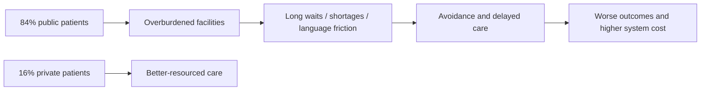
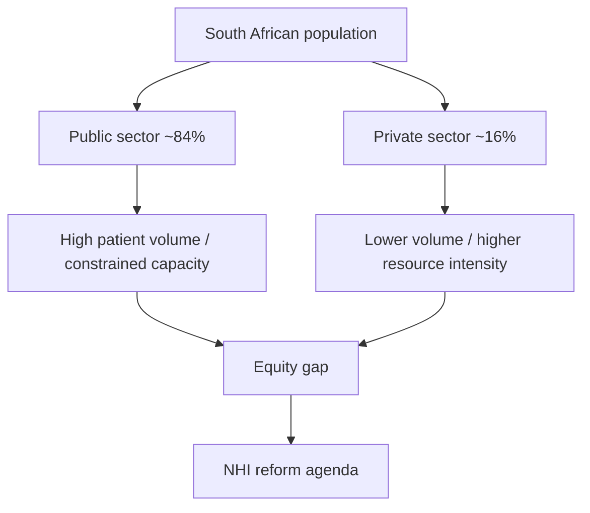
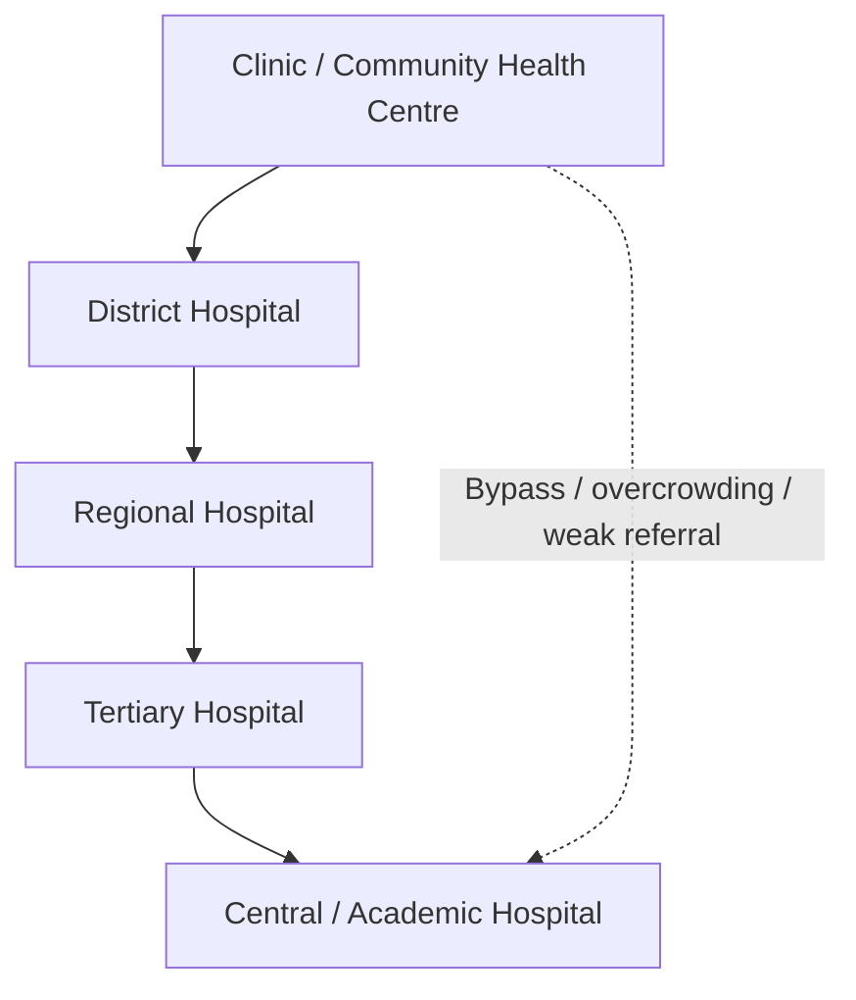
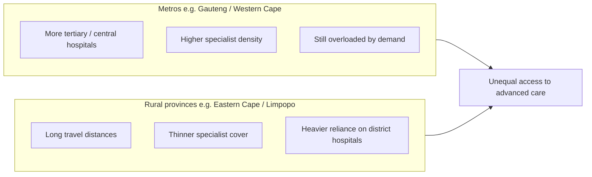
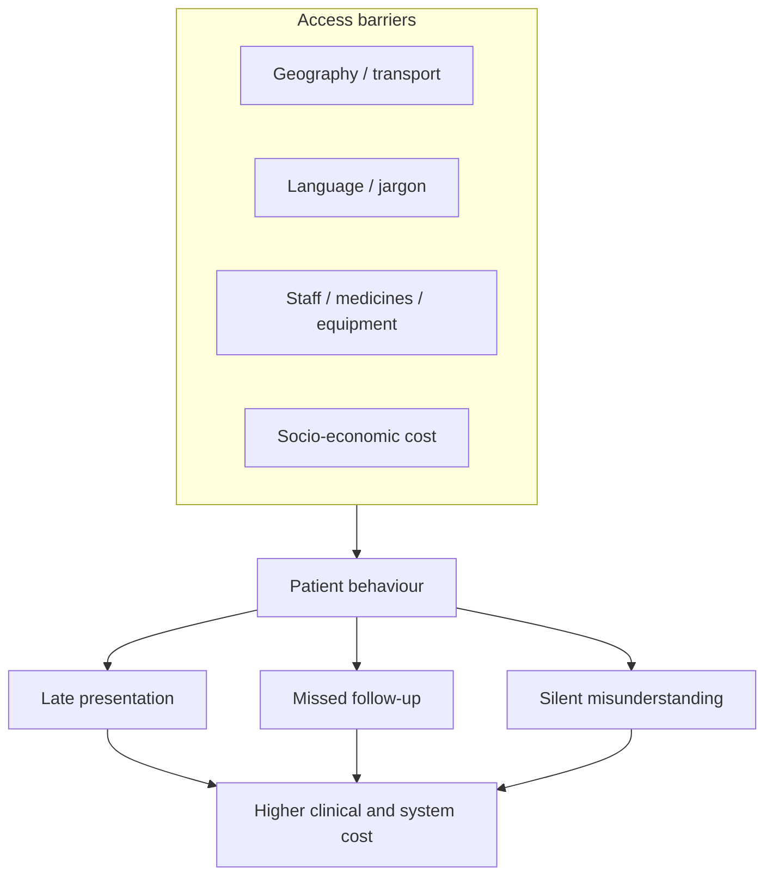
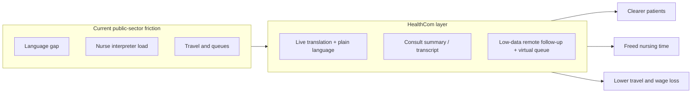
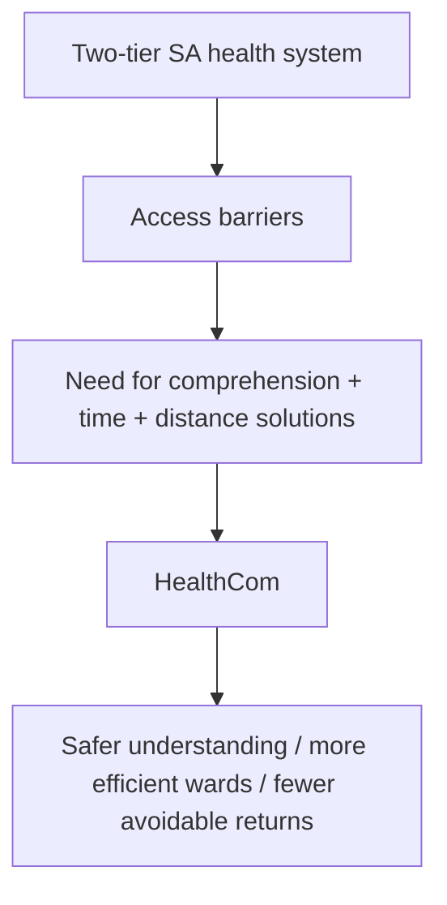

# South Africa’s Healthcare System

## Dual Structure, Access Barriers, and Implications for HealthCom

| | |
| --- | --- |
| **Document type** | Research brief |
| **Prepared for** | HealthCom |
| **Scope** | National public/private architecture, referral system, access barriers |
| **Companion brief** | [DGMAH communication barriers report](../01_DGMAH/DGMAH_report.md) |
| **Last updated** | September 2026 |

## Executive summary

> **One-page brief for hospital leadership, DoH stakeholders, and HealthCom pitches.**

South Africa runs a **two-tiered health system**: a strained public sector for most people, and a better-resourced private sector for a minority with medical scheme cover. Roughly **84%** of the population uses public care, while about **16%** uses private care, yet the private sector still absorbs around **half** of total health expenditure (National Department of Health).

**How care is organised.** Public services escalate through the District Health System: clinics and community health centres → district → regional → tertiary → central/academic hospitals (for example DGMAH and Groote Schuur). That pathway is rational on paper, but weak links, travel distance, and capacity gaps break it in practice.

**Where inequity bites.** Resources and specialists cluster in metros such as Gauteng and the Western Cape. Rural provinces (Eastern Cape, Limpopo, and others) face long travel distances, thinner specialist coverage, and fewer functioning referral options. Public facilities also face medicine stock-outs, equipment failures, staff shortages, and long waits.

**Access is more than “is there a clinic nearby?”** Drawing on Levesque’s access framework, patients hit overlapping barriers: geography and transport, language and jargon, personnel shortages, and socio-economic cost (lost wages, taxi fares). Free care at the point of service can still be unaffordable in practice.

**Policy backdrop.** The National Health Insurance (NHI) Act aims to move toward universal coverage by pooling funds and purchasing from public and private providers. Implementation is phased and contested; meanwhile, day-to-day public-sector friction remains the lived reality for most patients.

**HealthCom implication.** The system problems below map cleanly to product opportunities: real-time language simplification, less nurse-as-interpreter burden, low-data remote follow-up, and virtual triage that reduces travel and lost-income costs.

**Bottom line:** HealthCom is not “another health app.” It is a response to structural access failure in the public system, starting with communication, time, and distance.

## Abstract

South Africa’s healthcare architecture is bifurcated between an overburdened public sector serving the majority of the population and a private sector serving a minority of insured users while commanding a disproportionate share of national health spending (Abaerei, Ncayiyana & Levin, 2017; National Department of Health). Care in the public sector is organised through a district-based referral ladder from primary clinics to central academic hospitals, but provincial disparities, specialist maldistribution, and multiple access barriers limit equitable use. This brief describes that architecture, synthesises key system and access constraints, and maps them to HealthCom product responses: multilingual plain-language support, reduced informal interpreting load, remote follow-up, and decentralised triage.

## 1. Introduction

Understanding HealthCom’s market requires understanding the system patients actually navigate. Most South Africans do not choose between equivalent public and private options. They depend on a public pathway that is free or low-cost at the point of service, yet constrained by capacity, distance, language, and time.

This brief covers four linked topics:

1. the public/private split and resource imbalance;
2. the public hospital referral hierarchy;
3. provincial and specialist inequities;
4. access barriers and HealthCom responses.

It should be read alongside the DGMAH brief, which provides local evidence that patients often stay silent even when they do not understand their care.

## 2. The two-tiered healthcare architecture

South Africa operates a deeply bifurcated system: a well-resourced private sector for a minority, and an overburdened public sector for the majority (Abaerei, Ncayiyana & Levin, 2017).

| Sector | Population served | Resource picture | Delivery footprint |
| --- | --- | --- | --- |
| **Public** | About 71% to 85% (majority uninsured); DoH commonly cites ~84% | Underfunded relative to patient volume | District health system: thousands of clinics/CHCs and hundreds of hospitals |
| **Private** | About 15% to 27% (medical schemes / out-of-pocket); DoH commonly cites ~16% | Absorbs roughly half of total health expenditure | Hundreds of private hospitals plus independent specialists |

This imbalance is the core policy problem NHI seeks to address: access based on need rather than ability to pay. Until reform is fully operational, public-sector patients remain HealthCom’s primary users and beneficiaries.

## 3. Public hospital classification and referral pathway

The state-funded sector escalates care through the District Health System (DHS), from primary care to highly specialised academic centres.

| Level | Role |
| --- | --- |
| **Primary care (clinics / CHCs)** | First contact for most patients; prevention, chronic care, basic acute care |
| **District hospitals** | First referral level; basic diagnostics, maternal care, general medical services |
| **Regional hospitals** | Specialist services in core domains (surgery, paediatrics, internal medicine, obstetrics) |
| **Tertiary hospitals** | Sub-specialist care (e.g. cardiology, oncology, neurosurgery); multi-district catchment |
| **Central / academic hospitals** | National-level complex care, teaching, and research (e.g. DGMAH, Groote Schuur) |

On paper, patients move upward only as clinical need increases. In practice, overcrowding, weak downward referral, transport failure, and trust gaps mean many patients arrive late, bypass lower levels, or abandon the pathway after a first confusing encounter.

## 4. Provincial disparities and spatial inequity

Public funding and capacity are not perfectly matched to disease burden. Population concentration, historical infrastructure patterns, and specialist location create sharp geographic inequality.

### 4.1 Metropolitan concentration

Urban hubs in Gauteng and the Western Cape hold the densest clusters of tertiary and central hospitals. High population density and inward migration still leave these facilities strained despite relatively stronger infrastructure.

### 4.2 Rural deficits

Provinces such as the Eastern Cape and Limpopo cover large, sparsely populated areas. Patients often depend on fragmented clinic and district-hospital networks, with extreme travel distances to regional or tertiary care.

### 4.3 Specialist maldistribution

National specialist density is low in absolute terms and heavily skewed by sector. Approximate published patterns show a stark public/private gap: the public sector retains far fewer specialists per 100,000 population than the private sector, limiting advanced care access especially outside major metros.

## 5. Systemic and access barriers

Patients navigating public care face overlapping barriers. Levesque, Harris and Russell (2013) conceptualise access as an interface between people and systems, not a single facility gate. In South Africa, that interface commonly fails in four ways.

### 5.1 Geographic and transport barriers

In rural regions, distance plus weak public transport blocks screening attendance, follow-ups, and timely emergency care. A “free” clinic visit can still require hours of travel and overnight cost.

### 5.2 Communication and language

Clinical reliance on English and Afrikaans frequently alienates patients who speak other official languages. That produces poor health literacy, prescription misunderstandings, and weaker adherence. The DGMAH companion brief shows the deeper behavioural problem: patients often do not ask when confused.

### 5.3 Resource and personnel shortages

Public facilities face shortages of medicines, functioning equipment, and trained staff. Results include long waiting times, delayed surgery, and rushed consultations where explanation and comprehension checking are the first things cut.

### 5.4 Socio-economic strain

Even when care is free at the point of service, opportunity costs (lost wages, transport, childcare) make seeking care expensive for the poorest households. Avoidance until crisis is a rational response to that cost structure.

## 6. Policy context: National Health Insurance

The NHI Act establishes a framework for universal health coverage through a central purchaser/payer model intended to reduce public/private inequity. Implementation is phased and remains politically and financially contested. For product strategy, the practical takeaway is:

- the **public majority** remains the near-term user base;
- pressure to improve **efficiency, access, and quality** will intensify;
- tools that reduce wasted clinical time, strengthen understanding, and cut avoidable return visits align with reform goals even before full NHI rollout.

## 7. From system barriers to HealthCom responses

The system diagnosis only matters if it shapes product design. The table below maps each major barrier to a concrete HealthCom capability.

| System barrier | What patients / wards experience | HealthCom response |
| --- | --- | --- |
| Language and jargon | Silence, misunderstanding, fear of “stupid” questions | Real-time translation plus jargon-to-plain-language explanation |
| Nurse-as-interpreter bottleneck | Nurses pulled from clinical work; slower wards | Automated interpretation support during consults |
| No take-home clarity | Patients leave and forget / misapply instructions | Translated plain-language consult summary on the patient’s phone |
| Geographic / transport friction | Costly travel for routine follow-up or results | Low-data telehealth and secure remote check-ins |
| Post-visit confusion | Medication errors after discharge | Asynchronous voice notes with translated clinic replies |
| Socio-economic queue cost | Full day lost wages for a clinic wait | Virtual queue / decentralised triage with readiness alerts |

### 7.1 Solving the language and jargon crisis

**Barrier:** Doctors use English and complex medical terms; patients stay silent and misunderstand treatment (see DGMAH evidence).

**Response:**

- live translated subtitles or audio into the patient’s preferred language;
- automatic jargon simplification (e.g. “hypertension” → “high blood pressure”), so patients do not need to risk asking.

### 7.2 Relieving the personnel bottleneck

**Barrier:** Clinics are understaffed; nurses become informal interpreters.

**Response:**

- translation handled in-app during the consultation, returning nurses to clinical work;
- automated consult summary for the patient and a clinical transcript for the record.

### 7.3 Reducing geographic and transport friction

**Barrier:** Rural patients travel far, at high personal cost, for basic follow-up.

**Response:**

- low-data virtual consultations for routine reviews;
- asynchronous voice notes when confusion appears after leaving the facility.

### 7.4 Bridging socio-economic cost

**Barrier:** A full day in a public queue costs a day’s wages, so patients delay care until crisis.

**Response:**

- digital waiting rooms / virtual triage;
- notify the patient when the clinician is ready, reducing idle time away from work.

## 8. Pitch-ready synthesis

> This application takes the proven efficiency of corporate meeting software (real-time translation, automated transcription, and remote video) and adapts it to South Africa’s public healthcare constraints. It returns clinical hours to nurses, lowers the communication fear patients carry into consultations, and reduces geographic and wage-loss barriers to basic care.

## 9. Conclusion

South Africa’s health system is structurally unequal: most people depend on a public sector that is capacity-constrained, geographically uneven, and communication-fragile, while a minority accesses better-resourced private care. Referral architecture exists, but access fails at the interfaces of language, distance, staffing, and socio-economic cost.

For HealthCom, that is the design brief. The product should not only “digitise the consult.” It should remove friction that the public system cannot staff its way out of quickly: misunderstanding, informal interpreting load, unnecessary travel, and wage-destroying queues.

## References

1. Abaerei, A. A., Ncayiyana, J., & Levin, J. (2017). Health-care utilization and associated factors in Gauteng province, South Africa. *Global Health Action*, 10(1), 1305765. [https://doi.org/10.1080/16549716.2017.1305765](https://doi.org/10.1080/16549716.2017.1305765)

2. Levesque, J. F., Harris, M. F., & Russell, G. (2013). Patient-centred access to health care: conceptualising access at the interface of health systems and populations. *International Journal for Equity in Health*, 12, 18. [https://doi.org/10.1186/1475-9276-12-18](https://doi.org/10.1186/1475-9276-12-18)

3. National Department of Health (South Africa). National Health Insurance overview and implementation materials. [https://www.health.gov.za/nhi/](https://www.health.gov.za/nhi/)

4. National Department of Health (South Africa). (2024). *National guideline on management of patient waiting time in clinics, community health centres, and outpatient departments of public hospitals*. Pretoria: NDoH.

5. Solanki, G., Myburgh, N., Wild, S., & Cornell, J. (2025). The National Health Insurance Act: Possible private health funding reform scenarios. *South African Medical Journal*, 115(5). [https://doi.org/10.7196/samj.2025.v115i5.2550](https://doi.org/10.7196/samj.2025.v115i5.2550)

6. HealthCom Research. (2026). *Communication barriers in South African healthcare: Evidence from Dr George Mukhari Academic Hospital and the national context* (Research brief). See `../01_DGMAH/DGMAH_report.md`.

## Appendix A: Suggested citation for this brief

> HealthCom Research. (2026). *South Africa’s healthcare system: Dual structure, access barriers, and implications for HealthCom* (Research brief). HealthCom.
