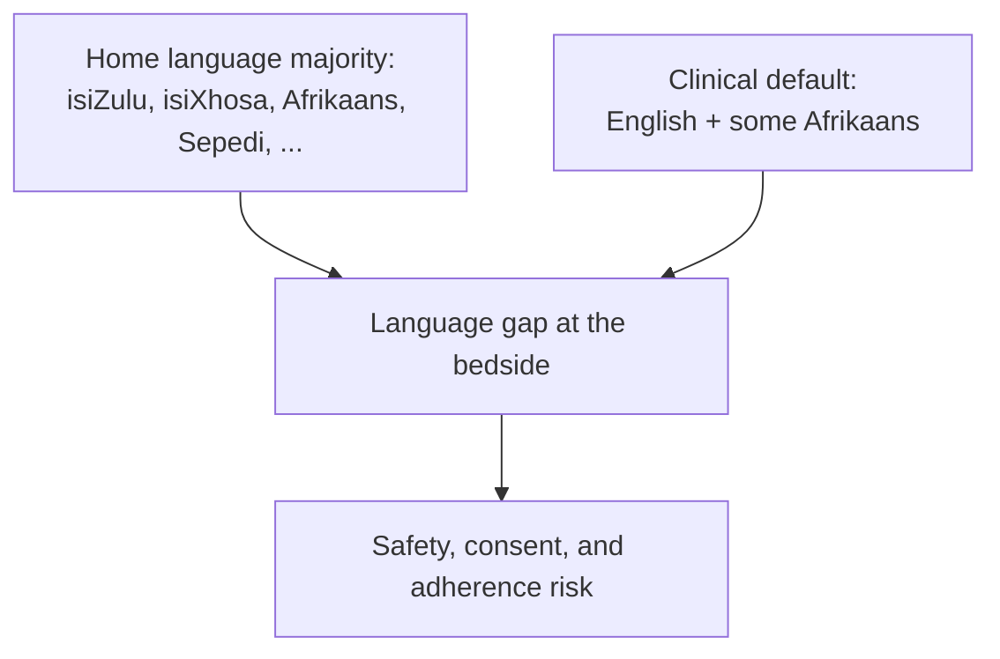
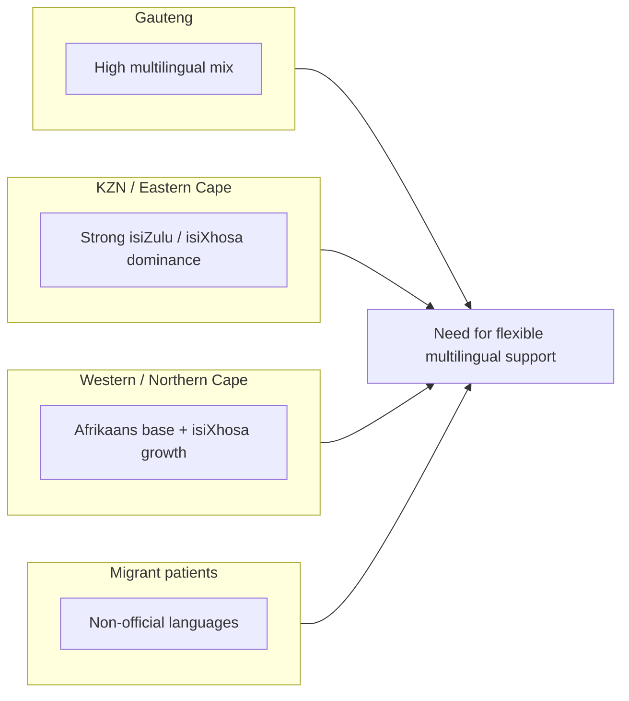
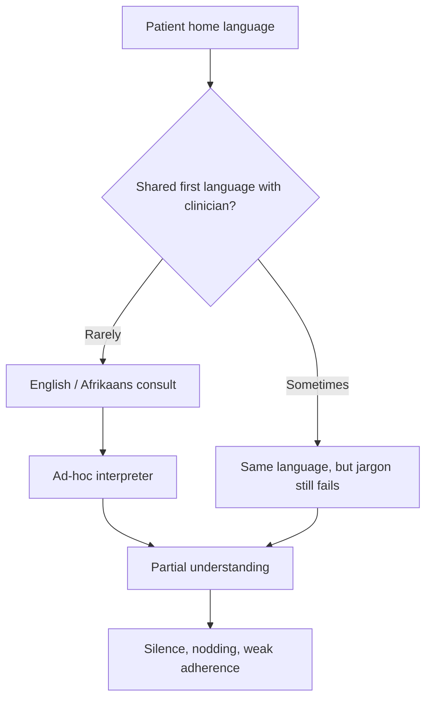
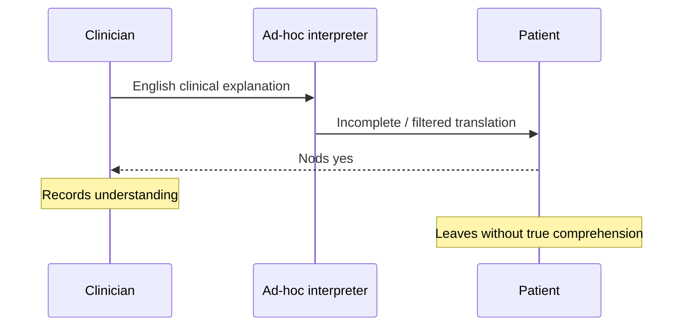
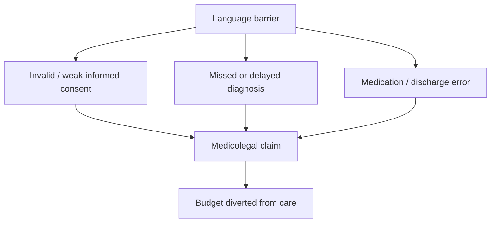
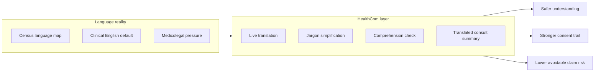

# South Africa’s Language Landscape in Healthcare

## Demographics, Clinical Mismatch, Legal Risk, and Implications for HealthCom

| | |
| --- | --- |
| **Document type** | Research brief |
| **Prepared for** | HealthCom |
| **Scope** | National language demographics, clinical communication mismatch, medicolegal exposure |
| **Companion briefs** | [DGMAH report](../01_DGMAH/DGMAH_report.md) · [SA healthcare system report](../02_Healthcare_Language_Barriers/SA_HealthCare_report.md) |
| **Last updated** | September 2026 |

## Executive summary

> **One-page brief for hospital leadership, DoH stakeholders, and HealthCom pitches.**

South Africa recognises **twelve official languages**, including South African Sign Language (SASL). Census 2022 shows that **isiZulu (24.4%)** and **isiXhosa (16.3%)** are the largest home languages, while **English is first language for only about 8.7%** of the population (Statistics South Africa, 2023). Healthcare delivery, training, and records still run largely in English (with Afrikaans retained in some settings). That is the core mismatch HealthCom is built to close.

**What that means clinically.** Most patients meet the health system in a second or third language. Formal medical interpreters are scarce, so wards rely on ad-hoc translators (nurses, relatives, cleaners). The result is omission, confidentiality breaches, and the “nod and smile” illusion of understanding (Schlemmer & Mash, 2006; Habib et al., 2023; Juckett & Unger, 2014).

**What that means legally and financially.** The Constitution and National Health Act require patients to receive health information in a language they understand. When that fails, informed consent, diagnosis, and discharge instructions become litigation risk. Public-sector medicolegal contingent liabilities and claim payouts have reached multi-billion-rand scale, consuming money that should fund care.

**Provincial reality is uneven.** Gauteng is highly multilingual; KwaZulu-Natal and Eastern Cape are often strongly isiZulu / isiXhosa in rural districts; Western and Northern Cape remain Afrikaans-heavy with growing isiXhosa demand; cross-border migrants add non-official languages with almost no formal translation support.

**HealthCom implication.** Language support is not a soft “patient experience” feature. It is a clinical safety, consent, and cost-control layer: preferred-language explanation, jargon simplification, comprehension checks, and take-home summaries that reduce misunderstanding-driven harm.

**Bottom line:** The country’s language map and the language of medicine do not match. HealthCom exists to bridge that gap at the point of care.

## Abstract

South Africa’s constitutional multilingualism collides with a largely monolingual clinical operating model. Census 2022 confirms that English is a minority home language, while African languages dominate household communication (Statistics South Africa, 2023). Research in South African hospitals links language discordance to poorer efficiency, weaker consent practices, reduced satisfaction, and unsafe reliance on untrained interpreters (Schlemmer & Mash, 2006; Levin, 2006; Benjamin et al., 2016). This brief maps national and provincial language demographics, explains the clinical communication mismatch, connects language failure to medicolegal exposure, and outlines HealthCom product implications.

## 1. Introduction

Language is not a peripheral detail of South African healthcare. It determines whether symptoms are described accurately, whether consent is real, whether medication instructions are followed, and whether patients return.

This brief covers:

1. national linguistic demographics;
2. provincial and migration dynamics;
3. the clinical communication mismatch;
4. ad-hoc interpreting risks;
5. legal duties and medicolegal cost;
6. HealthCom design implications.

Read with the DGMAH brief (why patients stay silent) and the SA healthcare system brief (why the public sector is already capacity-constrained).

## 2. National linguistic demographics

South Africa’s language framework recognises twelve official languages. Census 2022 shows a highly unequal home-language distribution and a sharp gap between languages spoken at home and languages used in formal health administration (Statistics South Africa, 2023).

### 2.1 Home-language distribution (Census 2022)

| Language | Share of population | Approx. home-language speakers |
| --- | --- | --- |
| isiZulu | 24.4% | ~15.1 million |
| isiXhosa | 16.3% | ~10.1 million |
| Afrikaans | 10.6% | ~6.5 million |
| Sepedi | 10.0% | ~6.2 million |
| English | 8.7% | ~5.3 million |
| Setswana | 8.3% | ~5.1 million |
| Sesotho | 7.8% | ~4.8 million |
| Xitsonga | ~4.7% | ~2.8 million |
| siSwati | ~2.8% | ~1.7 million |
| Tshivenda | ~2.5% | ~1.5 million |
| isiNdebele | ~1.7% | ~1.0 million |
| Other / non-official | ~2.1% | ~1.6 million |
| SASL (census estimate) | ~0.02% | contested; other estimates far higher |

English is the lingua franca of business, state discourse, and medical literature, yet it is the primary household language for fewer than 9% of people. Most patients therefore enter care in a second or third language.

### 2.2 SASL note

SASL became the twelfth official language in 2023. Census figures for SASL users are contested and likely undercount Deaf communities. HealthCom should treat SASL as a distinct accessibility track (visual language), not as a minor spoken-language variant. See the dedicated SASL research folder for deeper work.

## 3. Provincial heterogeneity and spatial language dynamics

Language barriers are not uniform. Provincial history and migration shape what each health department must solve.

### 3.1 Gauteng

Extreme linguistic heterogeneity driven by internal migration. Roughly balanced mixes of Nguni, Sotho-Tswana, and Indo-European language speakers, plus a high share of multilingual households (~17%). Language prediction at the bedside is hard; translator demand is broad rather than single-language.

### 3.2 KwaZulu-Natal and Eastern Cape

Rural districts are often strongly monolingual (isiZulu or isiXhosa). Clinicians deployed from elsewhere, or foreign-trained staff, can face near-absolute language barriers without interpreters (Benjamin et al., 2016).

### 3.3 Western Cape and Northern Cape

Afrikaans remains dominant for large population groups, while isiXhosa migration into the Western Cape has increased demand that many facilities are not staffed to meet.

### 3.4 Cross-border migration

South Africa receives substantial migrant and asylum-seeking populations. More than a million residents speak non-official languages such as Shona, Chichewa, and Portuguese. Public hospitals typically have no formal translation pathway for these languages, creating acute vulnerability.

## 4. The clinical communication mismatch

A structural contradiction sits at the centre of South African care: a multilingual patient population served by a largely monolingual clinical system.

Medical education and administration are conducted almost exclusively in English, with Afrikaans retaining a historical presence in some institutions. Research in district and paediatric hospitals shows that only a fraction of interviews happen fully in the patient’s home language (Meuter et al., 2015; Schlemmer & Mash, 2006; Levin, 2006).

Typical failure modes:

- clinicians lack vocabulary to explain physiology or regimens in African languages;
- patients lack English precision to describe abstract symptoms;
- both sides underestimate how much was lost;
- cultural illness models and discordant term meanings deepen misunderstanding (Levin, 2006).

## 5. Ad-hoc interpretation and clinical risks

Without trained medical interpreters, public facilities default to improvisation. That carries ethical and clinical consequences (Juckett & Unger, 2014; Habib et al., 2023).

| Practice | Risk |
| --- | --- |
| Bilingual nurses pulled mid-shift | Omissions/additions; nurses diverted from clinical work |
| Cleaners / porters / other patients used | Zero medical translation training; confidentiality breach |
| Family members (including minors) used | Sensitive disclosures suppressed; biased filtering |
| Doctor uses fragmented second-language phrases | “Illusion of competence”; false fluency |

### 5.1 Confidentiality and empathy

Patients withhold information about sexual health, domestic violence, or substance use when a relative or community acquaintance interprets. Empathy and trust collapse when the conversation is no longer private.

### 5.2 The illusion of competence

Code-switching and a few memorised phrases can look like communication while critical meaning is missing. Patients with limited English often agree out of deference, masking total non-comprehension of diagnosis or dose (linked to DGMAH silence findings).

## 6. Legal imperatives

The National Health Act (Act 61 of 2003) and the Constitution support the right to receive healthcare information in a language the patient understands. In practice, interpreter infrastructure is still thin, and language policy is unevenly operationalised.

When communication fails, facilities face:

- longer consultations and staff frustration;
- reduced clinical empathy;
- patient avoidance of follow-up;
- later, costlier disease presentation;
- weakened informed-consent defensibility.

Language failure is therefore both a rights issue and an operations issue.

## 7. Medicolegal and financial urgency

Language barriers are not only quality problems. They feed the medicolegal burden on the public system.

### 7.1 Scale of contingent liability and payouts

Published reporting and parliamentary disclosures describe a severe fiscal load:

| Indicator | Reported magnitude | Why it matters |
| --- | --- | --- |
| Contingent medicolegal claims against the state | Estimates around R62 billion (and some higher provincial aggregates) | Locks future budget away from service delivery |
| Claims paid (2020–2023) | About R23.6 billion across provinces | Direct cash leaving the health system |
| Legal defence costs (2020–2023) | About R1.3 billion | Spend defending cases, including indefensible ones |

Exact figures move with reporting date and province, but the direction is consistent: negligence liability is a major drain on public health finance (Democratic Alliance, 2024; GroundUp reporting; Oosthuizen & Erasmus, 2022).

### 7.2 Communication as a root cause, not a soft factor

Claims are often labelled by outcome (cerebral palsy, surgical complication, medication harm). Underneath many of those outcomes sit communication failures: incomplete history-taking, weak informed consent, misunderstood discharge advice, and delayed escalation.

## 8. How language failure becomes a claim

### 8.1 Informed consent trap

A surgeon explains risks in English; a Setswana-speaking patient nods and signs an English form. If a known complication occurs, the facility may be unable to prove the patient understood material risks. Without valid informed consent, exposure is severe.

### 8.2 Obstetrics and high-value claims

Obstetrics drives many of the largest state claims, including cerebral palsy cases linked to delayed intervention. If a labouring patient cannot convey timing or severity of warning symptoms across a language gap, escalation is delayed and lifelong damages follow.

### 8.3 Medication and post-discharge error

Nuance such as “with food” versus “on an empty stomach” is easily lost through untrained interpreters. Adverse events at home then become negligence exposure if discharge counselling was not provided in an understandable language.

### 8.4 False fluency and misdiagnosis

Fragmented shared English can turn “radiating chest pain” into “heartburn.” The patient is discharged; catastrophe follows; the record shows a consult that looked adequate on paper.

| Pathway | Communication failure | Typical consequence |
| --- | --- | --- |
| Consent | Form signed without understanding | Consent litigation |
| Obstetrics | Symptom severity lost in translation | Delayed C-section / CP claims |
| Medication | Dose/timing nuance dropped | Readmission / disability claims |
| Diagnosis | False fluency hides red flags | Misdiagnosis / wrongful death claims |

## 9. Implications for HealthCom

| Evidence theme | Product requirement |
| --- | --- |
| English is minority home language | Default to patient-preferred language, not clinician language |
| Provinces differ sharply | Prioritise flexible multilingual packs, not one-province assumptions |
| Ad-hoc interpreting is unsafe | Reduce dependence on nurses/family for routine explanation |
| Nodding ≠ understanding | Build teach-back / comprehension checks |
| Consent is a legal flashpoint | Produce plain-language, preferred-language consent explanations and records |
| Discharge is high-risk | Issue take-home translated summaries and medication instructions |
| Migrant languages are unsupported | Roadmap beyond the 11 spoken official languages where feasible |
| SASL is distinct | Separate accessibility pathway for Deaf users |

## 10. Conclusion

South Africa’s patients overwhelmingly speak African languages at home. Its clinical system overwhelmingly operates in English. That mismatch is bridged today by improvisation, and improvisation is not a safety strategy.

The demographic evidence, hospital research, legal duties, and medicolegal cost trajectory all point the same way: preferred-language communication with verified understanding is infrastructure, not a nice-to-have. HealthCom’s role is to make that infrastructure available at the bedside and after discharge.

## References

1. Benjamin, E., Swartz, L., Hering, L., & Chiliza, B. (2016). Language barriers in health: Lessons from the experiences of trained interpreters working in public sector hospitals in the Western Cape. In A. Padarath et al. (Eds.), *South African Health Review 2016* (pp. 73–81). Health Systems Trust.

2. Democratic Alliance. (2024). *R23.6 billion paid in medical legal claims from 2020 to date*. [https://www.da.org.za/2024/03/r23-6-billion-paid-in-medical-legal-claims-from-2020-to-date-a-red-herring-for-nhi](https://www.da.org.za/2024/03/r23-6-billion-paid-in-medical-legal-claims-from-2020-to-date-a-red-herring-for-nhi)

3. Habib, T., et al. (2023). Do not lose your patient in translation: Using interpreters effectively in primary care. *South African Family Practice*, 65(1), a5655. [https://doi.org/10.4102/safp.v65i1.5655](https://doi.org/10.4102/safp.v65i1.5655)

4. Juckett, G., & Unger, K. (2014). Appropriate use of medical interpreters. *American Family Physician*, 90(7), 476–480.

5. Levin, M. E. (2006). Language as a barrier to care for Xhosa-speaking patients at a South African paediatric teaching hospital. *South African Medical Journal*, 96(10), 1076–1079.

6. Meuter, R. F. I., Gallois, C., Segalowitz, N. S., Ryder, A. G., & Hocking, J. (2015). Overcoming language barriers in healthcare: A protocol for investigating safe and effective communication when patients or clinicians use a second language. *BMC Health Services Research*, 15, 371. [https://doi.org/10.1186/s12913-015-1024-8](https://doi.org/10.1186/s12913-015-1024-8)

7. Oosthuizen, W. T., & Erasmus, E. (2022). Medical malpractice in the South African public sector. Available via ResearchGate publication record.

8. Schlemmer, A., & Mash, B. (2006). The effects of a language barrier in a South African district hospital. *South African Medical Journal*, 96(10), 1084–1087.

9. Statistics South Africa. (2023). *Census 2022: Statistical release*. Pretoria: Stats SA.

10. Republic of South Africa. (2003). *National Health Act 61 of 2003*.

11. HealthCom Research. (2026). *Communication barriers in South African healthcare* (DGMAH brief). See `../01_DGMAH/DGMAH_report.md`.

12. HealthCom Research. (2026). *South Africa’s healthcare system* (system brief). See `../02_Healthcare_Language_Barriers/SA_HealthCare_report.md`.

## Appendix A: Suggested citation for this brief

> HealthCom Research. (2026). *South Africa’s language landscape in healthcare: Demographics, clinical mismatch, legal risk, and implications for HealthCom* (Research brief). HealthCom.
