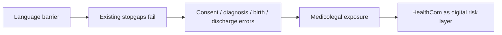
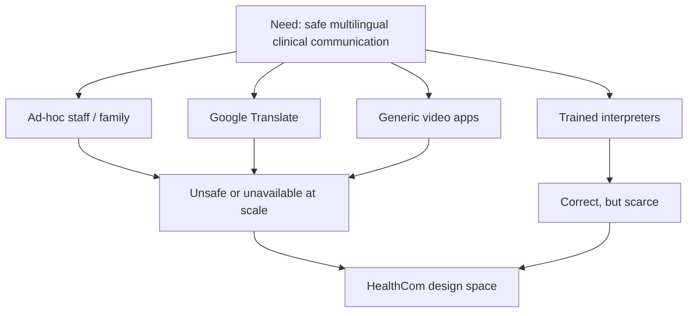
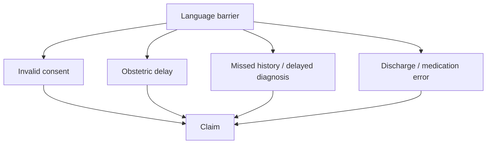
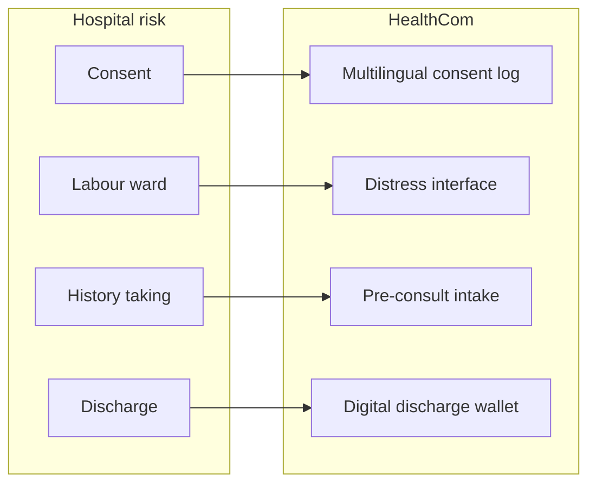
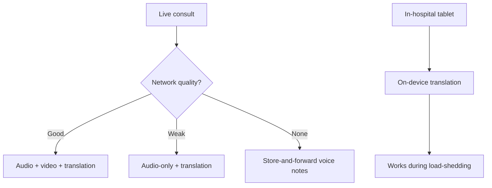

# Existing Solutions and the HealthCom Gap

## Why Generic Tools Fail, How Communication Errors Become Claims, and What HealthCom Must Build

| | |
| --- | --- |
| **Document type** | Research and product brief |
| **Prepared for** | HealthCom |
| **Scope** | Status-quo tools, liability pathways, HealthCom feature map, POPIA-aware architecture |
| **Companion briefs** | [DGMAH](../01_DGMAH/DGMAH_report.md) · [SA healthcare](../02_Healthcare_Language_Barriers/SA_HealthCare_report.md) · [Language landscape](../03_South_African_Languages/Language_Landscape_report.md) |
| **Last updated** | September 2026 |

## Executive summary

> **One-page brief for hospital leadership, DoH stakeholders, and HealthCom pitches.**

South Africa already has “solutions” for language in healthcare. They are mostly **improvisation** (nurses, relatives, Google Translate) or **generic software** (Zoom, WhatsApp, consumer captioning). None combine preferred-language clinical communication, comprehension checks, consent evidence, and public-sector constraints (POPIA, load-shedding, low bandwidth).

That gap is expensive. Communication failure is not a customer-service issue. It sits under four highly litigated error types:

1. **Invalid informed consent** (signature without understanding)
2. **Obstetric delay** (symptoms of fetal distress lost in translation)
3. **Missed history / delayed diagnosis**
4. **Discharge and medication misunderstanding**

South African law, after *Castell v De Greef* (1994) and section 7 of the National Health Act 61 of 2003, requires communication a **reasonable patient** can understand, in a language they understand. A nod on an English form is not a legal shield.

HealthCom’s offer to administrators is therefore **risk management**, not “better meetings”: verifiable multilingual consent logging, rapid-response ward interfaces, pre-consult intake, and a digital discharge wallet, hosted in a way public hospitals can accept.

**Bottom line:** Sell a POPIA-aware, low-data clinical communication record that generic translation apps cannot provide.

## Abstract

Public-sector South African care still bridges language gaps with ad-hoc interpreters and consumer tools that are inaccurate, unaccountable, or operationally unfit (Patil & Davies, 2014; Schlemmer & Mash, 2006). This brief reviews those existing approaches, maps communication failure onto four litigation pathways (consent, obstetrics, diagnosis, discharge), and specifies HealthCom capabilities and infrastructure choices (local cloud, WebRTC, asynchronous fallback, edge translation) that address both clinical risk and data-protection expectations.

## 1. Introduction

Hospitals will ask: *why not Google Translate and WhatsApp?* This brief answers that, then shows how HealthCom maps onto the exact liabilities that drain public health budgets.

It has four parts:

1. existing solutions and why they fall short;
2. four communication-driven error categories;
3. HealthCom feature-to-liability mapping;
4. architecture constraints (POPIA, HPCSA, low-data, load-shedding).

## 2. Existing solutions: the real competitive set

HealthCom is not competing with “another Zoom.” It is competing with the **status quo mix** hospitals already use.

| Approach | What it is | Why it fails in SA public care |
| --- | --- | --- |
| **Ad-hoc interpreters** | Nurses, family, cleaners translating live | Untrained, confidentiality risk, diverts clinical labour |
| **Consumer MT** (Google Translate etc.) | Generic machine translation | Unsafe for consent and high-stakes phrases; African languages historically weakest in evaluations |
| **Phrasebook apps** (e.g. MediBabble-style tools) | Pre-set clinical phrases | No free-form history, no SA language depth, no consent record |
| **Consumer video** (Zoom, Teams, WhatsApp) | Remote calling | HD-first, weak offline story, not built for teach-back, consent logs, or ward distress |
| **Professional interpreters** | Trained medical interpreters | Gold standard, but scarce and rarely staffed in public facilities |

### 2.1 Why Google Translate is not a clinical control

Patil and Davies (2014) found Google Translate correct for only **57.7%** of tested medical phrases across 26 languages, with **African languages among the least accurate**. Some errors inverted meaning in dangerous ways. The authors cautioned against using it for consent.

Consumer MT also typically lacks:

- clinical terminology control;
- an audit trail of what the patient heard and acknowledged;
- POPIA-aligned processing for health data;
- teach-back or comprehension verification.

### 2.2 Why generic meeting software is not enough

Corporate captioning and transcription assume stable broadband, English-first meetings, and low legal stakes. Public clinics face load-shedding, 3G, multilingual consults, and consent law. Translation without a **defensible record of understanding** does not close the hospital’s risk.

## 3. Four communication-driven error categories

Malpractice cost in South Africa is not only surgical error. Language barriers turn high-stakes care into litigable failure.

### 3.1 Legal invalidation of informed consent

A signature is not consent if the patient did not understand the material.

After *Castell v De Greef* 1994 (4) SA 408 (C), South African medical law moved toward a **reasonable patient** standard: what this patient needed to know, not only what a reasonable doctor would customarily say. **Section 7 of the National Health Act 61 of 2003** requires communication of diagnosis, risks, benefits, and alternatives in a language the user understands, with literacy taken into account.

When risks are explained in English to an isiZulu- or Sepedi-speaking patient, nodding is often deference, not comprehension. Counsel can argue consent was invalid. A recognised complication then becomes a negligence (and potentially battery) claim, with damages for earnings, general damages, and future care (DSC Attorneys; Kgomotso, 2025).

### 3.2 Obstetric negligence and cerebral palsy claims

Birth asphyxia / hypoxic-ischaemic encephalopathy (HIE) leading to cerebral palsy drives many of the largest state payouts. Individual claims commonly land in the tens of millions of rand because they fund lifelong care.

Labour requires continuous, precise communication. When midwives and doctors do not share the mother’s language, reports of pain, contraction change, or reduced fetal movement are missed or delayed (Matlala & Lumadi, 2019/2021 literature on labour-ward experience). Delayed emergency caesarean section is then framed as a communication-enabled systems failure, not only a clinical one.

### 3.3 Diagnostic delay and omitted history

Diagnosis depends on history: quality of pain, radiation, timing, associated symptoms. Second-language patients often lack English anatomical or temporal vocabulary (“sharp radiating” vs “dull ache”). Ad-hoc interpreters filter further. Early malignancy, cardiac ischaemia, or sepsis can be labelled benign until it is too late, exposing the facility for delayed diagnosis and failure to meet an acceptable standard of care.

### 3.4 Medication errors and post-operative events

Patients with communication vulnerability experience more adverse events than those who can communicate freely (Bornman and related SA communication-vulnerability literature). Discharge instructions in English jargon are a classic failure point: dose, food timing, wound-care red flags. Readmission, sepsis, or death after misunderstood instructions becomes a “failure to counsel” claim.

| Error category | Communication failure | Typical legal story |
| --- | --- | --- |
| Consent | English form + nod | No valid informed consent |
| Obstetrics | Distress not understood in time | Delayed emergency intervention |
| Diagnosis | History incomplete / mistranslated | Delayed or missed diagnosis |
| Discharge | Instructions not understood | Preventable post-op / medication harm |

## 4. HealthCom as a digital liability layer

The pitch to administrators: **POPIA- and HPCSA-aware risk management**, not “better meetings.”

### 4.1 Verifiable multilingual consent logging

**Liability:** Patients sign English forms they do not understand (National Health Act s7).

**Feature:**

- show the consent content in the patient’s language on a shared screen;
- optional audio of the clinician’s explanation and the patient’s verbal acknowledgement;
- time-stamped record of what was presented and acknowledged.

**Mitigation:** Replaces “he said / she said” with a retrievable preferred-language record. This **strengthens** defence of consent practice; it does not magically erase clinical negligence. Design must still include a comprehension check, not only a recording.

### 4.2 Rapid-response obstetric distress interface

**Liability:** Labouring mothers cannot report distress in the clinician’s language.

**Feature (ward tablet):**

- visual pain/location scales plus speech in home language;
- instant translation into a clinician-facing alert (e.g. reduced fetal movement; severe continuous pain).

**Mitigation:** Shortens the delay between patient report and clinical recognition, which is the mechanism behind many high-value birth-injury claims.

### 4.3 Pre-consultation multilingual intake

**Liability:** Doctors miss subtle history in fragmented English.

**Feature:**

- voice or structured questions in the patient’s language before the consult;
- transcribed, translated, and mapped toward standard clinical phrasing for the clinician.

**Mitigation:** The consult starts with a fuller history, reducing dependence on ad-hoc interpreters for the narrative of illness.

### 4.4 Digital discharge wallet

**Liability:** Misunderstood English discharge instructions.

**Feature:**

- translated written summary of care and medicines;
- matching voice note in the home language (“two tablets in the morning with food”);
- delivered to the patient’s phone.

**Mitigation:** Evidence that understandable instructions were issued and received. Pair with teach-back so the record shows comprehension, not only transmission.

### 4.5 Pitch line

> Digitising translation and transcription of clinical interactions gives hospitals a verifiable record of what was explained. It turns subjective miscommunication disputes into reviewable digital evidence, while still requiring clinical judgement and confirmed understanding.

## 5. Architecture constraints: POPIA, latency, and low data

### 5.1 Data protection and hosting

Health information is special personal information under **POPIA**. Cross-border transfer is not an informal “send it to a US API” decision; it requires a lawful basis and adequate protection (POPIA s72 and related conditions). HPCSA guidance on electronic records and telemedicine further raises expectations for security, confidentiality, and professional control of clinical information.

For public-hospital procurement, **South African data residency** is the practical default: simpler DPIAs, easier DoH conversations, lower political risk.

| Option | Region | Fit |
| --- | --- | --- |
| **AWS Africa** | Cape Town (`af-south-1`) | Strong startup/scalability option; local residency |
| **Azure South Africa North** | Johannesburg | Often easier DoH/public-sector story where Microsoft stacks already exist |

Do not treat foreign consumer translation APIs as a silent backend for clinical speech.

### 5.2 Low-data telehealth

Rural patients and clinics cannot rely on HD video.

| Design choice | Why |
| --- | --- |
| **WebRTC** | Peer-to-peer where possible; lower data and latency than always-on media servers |
| **Audio-first degradation** | If 3G collapses, drop video, keep audio + translation session |
| **Store-and-forward** | Voice notes saved offline, upload when signal returns |
| **Ward edge AI** | On-device translation models so maternity/ward use survives Wi-Fi and load-shedding |

## 6. Synthesis: existing tools vs HealthCom

| Requirement | Google Translate / WhatsApp / Zoom | HealthCom target |
| --- | --- | --- |
| SA clinical languages | Weak / generic | First-class product requirement |
| Consent evidence | None | Time-stamped multilingual log + teach-back |
| Ward emergency use | Unusable | Tablet distress UI + clinician alert |
| History capture | Chat chaos | Structured multilingual intake |
| Discharge | Screenshot of English text | Translated summary + voice |
| POPIA / residency | Usually offshore consumer stacks | Local region + health-data controls |
| Load-shedding / 3G | Session death | Audio-first + offline queue + edge |

## 7. Conclusion

Existing solutions leave South African public hospitals with a false choice: unsafe improvisation or scarce professional interpreters. Consumer translation and meeting apps do not meet consent law, African-language risk, or clinic operating conditions.

HealthCom should be positioned as the missing layer: **understandable care plus a defensible record**, mapped onto consent, obstetrics, diagnosis, and discharge, and engineered for POPIA, local hosting, and low-data reality.

## References

1. Bornman, J., et al. (2021). Communication vulnerability in South African health care: the role of AAC. Related SAMJ / University of Pretoria research record.

2. *Castell v De Greef* 1994 (4) SA 408 (C).

3. DSC Attorneys. Informed consent and medical malpractice claims in South Africa. [https://www.dsclaw.co.za/articles/informed-consent-and-medical-malpractice-claims-in-south-africa/](https://www.dsclaw.co.za/articles/informed-consent-and-medical-malpractice-claims-in-south-africa/)

4. Kgomotso, S. (2025). Medical malpractice related to informed consent. KEBD Law. [https://www.kebd.co.za/medical-malpractice-related-to-informed-consent/](https://www.kebd.co.za/medical-malpractice-related-to-informed-consent/)

5. Matlala, M. S., & Lumadi, T. G. (2019). Perceptions of midwives regarding the role of traditional birth attendants during labour in a district hospital. *Curationis* / related labour-care literature; see also later HSAG work on midwives’ labour-ward experience.

6. Pan, S. J., & Davies, J. M. / Patil, S. B., & Davies, P. (2014). Use of Google Translate in medical communication: evaluation of accuracy. *BMJ*, 349, g7392. [https://doi.org/10.1136/bmj.g7392](https://doi.org/10.1136/bmj.g7392)

7. Republic of South Africa. (2003). *National Health Act 61 of 2003*, section 7.

8. Republic of South Africa. (2013). *Protection of Personal Information Act 4 of 2013*.

9. Schlemmer, A., & Mash, B. (2006). The effects of a language barrier in a South African district hospital. *South African Medical Journal*, 96(10), 1084–1087.

10. HealthCom Research. (2026). Companion briefs in `../01_DGMAH`, `../02_Healthcare_Language_Barriers`, and `../03_South_African_Languages`.

## Appendix A: Suggested citation for this brief

> HealthCom Research. (2026). *Existing solutions and the HealthCom gap: Why generic tools fail, how communication errors become claims, and what HealthCom must build* (Research brief). HealthCom.
