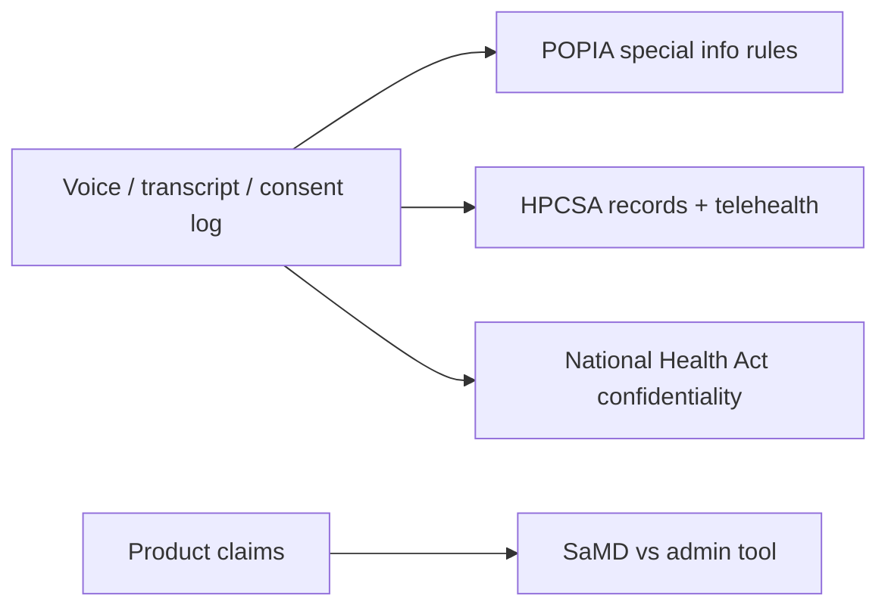
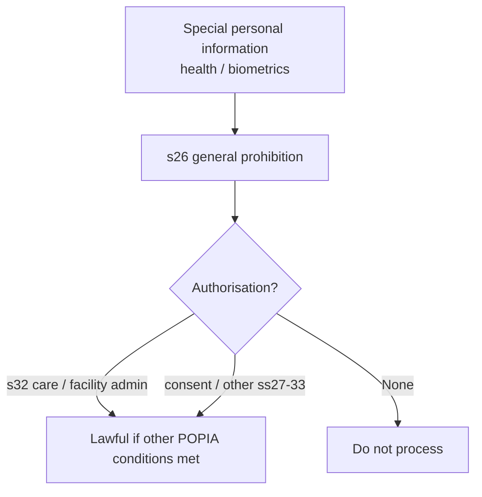
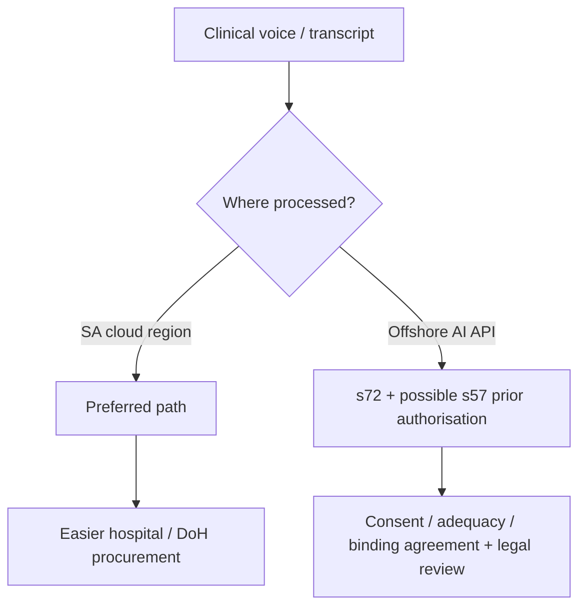
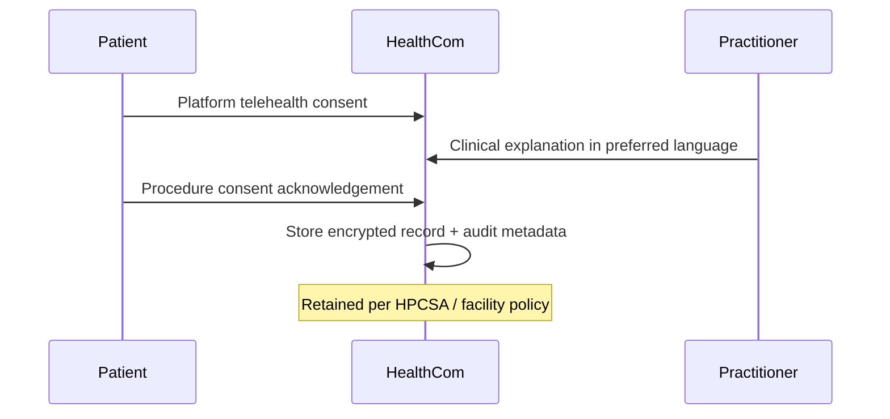
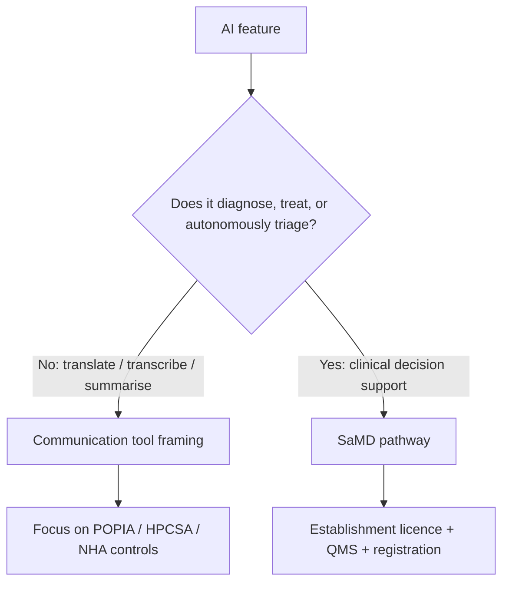
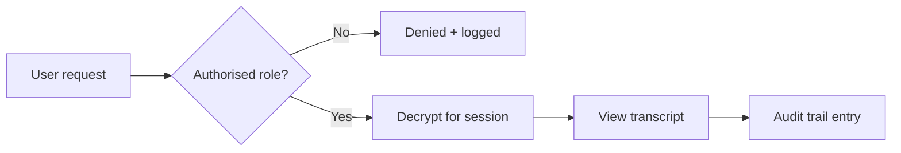

# Regulatory and Privacy Requirements for HealthCom

## POPIA, HPCSA, SAHPRA, and the National Health Act

| | |
| --- | --- |
| **Document type** | Research and compliance brief |
| **Prepared for** | HealthCom |
| **Scope** | Data protection, telehealth ethics, SaMD boundary, confidentiality controls |
| **Companion briefs** | [Existing solutions](../Existing_Solutions/Existing_Solutions_report.md) · [Language landscape](../Language_Landscape/Language_Landscape_report.md) · [SA healthcare](../South_African_Healthcare/SA_HealthCare_report.md) |
| **Last updated** | September 2026 |
| **Disclaimer** | Research synthesis for product design, not formal legal advice |

## Executive summary

> **One-page brief for founders, hospital IT, and DoH conversations.**

HealthCom processes **health data**: voice, transcripts, consent logs, and clinical summaries. Under South African law that is not ordinary personal information. It is **special personal information**, with tighter rules for processing, security, retention, and cross-border transfer.

Four regimes matter most:

| Regime | What it controls for HealthCom |
| --- | --- |
| **POPIA** | Lawful processing, operator contracts, security, cross-border transfers |
| **HPCSA Booklets 9 & 10** | Digital records, retention, telehealth consent and ethics |
| **SAHPRA** | Whether the product is “communication software” or Software as a Medical Device (SaMD) |
| **National Health Act s14** | Confidentiality, access control, breach accountability |

**Design rule of thumb**

1. Treat hospital/clinician as **Responsible Party**; HealthCom as **Operator** under a written section 21 agreement.
2. Prefer **South African cloud regions** (AWS Cape Town / Azure Johannesburg) for residency, procurement comfort, and lower section 57 risk.
3. Keep AI inside a **linguistic / communication** lane unless you deliberately choose SaMD registration.
4. Build **RBAC + encryption + audit trails + retention automation** as product requirements, not later add-ons.

**Bottom line:** Compliance is part of the product. Local hosting, operator contracts, consent UX, and a clear non-diagnostic AI boundary are what make HealthCom sellable to public hospitals.

## Abstract

Digital health tools in South Africa must satisfy overlapping duties under the Protection of Personal Information Act 4 of 2013 (POPIA), Health Professions Council of South Africa (HPCSA) ethical guidelines, South African Health Products Regulatory Authority (SAHPRA) medical-device rules, and confidentiality duties in the National Health Act 61 of 2003. This brief translates those regimes into product requirements for HealthCom: lawful bases for health-data processing, responsible-party/operator roles, cross-border transfer caution, telehealth and record retention rules, the SaMD threshold, and technical controls (RBAC, encryption, audit logs).

## 1. Introduction

Hospitals will not adopt a translation layer that creates new privacy or licensing risk. Regulatory design is therefore a go-to-market requirement.

This brief covers:

1. POPIA and special personal information;
2. HPCSA telehealth and digital records;
3. SAHPRA / Software as a Medical Device boundary;
4. National Health Act confidentiality controls;
5. a practical HealthCom compliance checklist.

## 2. POPIA and special personal information

### 2.1 Health data is specially protected

POPIA classifies information concerning a person’s **health** (and biometrics) as **special personal information** under **section 26**. Processing is generally prohibited unless an authorisation in sections 27–33 applies (Republic of South Africa, 2013).

For clinical use, the central pathway is **section 32**: medical professionals, healthcare institutions, and facilities may process health information where necessary for proper treatment and care, or for administration of the practice/institution, subject to confidentiality.

HealthCom’s translation and transcription features can sit inside that care pathway, but only if:

- processing is necessary for care (purpose limitation);
- confidentiality is enforced technically and contractually;
- the other POPIA conditions (security, minimisation, openness, data-subject rights) still apply.

Section 32 is an authorisation, not a free pass.

### 2.2 Responsible Party vs Operator

| Role | Who | Duty |
| --- | --- | --- |
| **Responsible Party** | Hospital / clinician / health establishment determining purpose and means | Accountable to patients and the Information Regulator |
| **Operator** | HealthCom processing on instruction | Security safeguards + written contract |

**Section 21** requires a written operator agreement. Hospitals will expect DPAs covering confidentiality, sub-processors, breach notice, deletion/return, and audit rights. HealthCom should assume it is an Operator in standard deployments unless it independently determines purposes (which would change the risk profile).

### 2.3 Cross-border transfers (sections 72 and 57)

POPIA does **not** impose a blanket ban on foreign hosting. **Section 72** allows transfers where one of the statutory gateways is met (adequate protection, binding agreement/corporate rules, consent, or certain contractual necessities).

However, for **special personal information**, **section 57(1)(d)** can require **prior authorisation** from the Information Regulator where the destination does not provide adequate protection. Routing unencrypted clinical voice notes through foreign consumer AI endpoints is therefore high-risk for public-hospital adoption even if a creative consent clause is drafted.

**Practical HealthCom position (recommended):**

- process and store clinical audio/transcripts in **South African regions** (e.g. AWS `af-south-1` Cape Town; Azure South Africa North Johannesburg);
- avoid silent offshore model calls for identifiable clinical content;
- if any cross-border processing is unavoidable, document the section 72 gateway, update privacy notices, and obtain legal review on section 57 triggers.

## 3. HPCSA telehealth and digital records

HPCSA ethical guidelines bind practitioners using digital platforms. HealthCom must make compliant practice easy.

### 3.1 Digital records have evidentiary weight

HPCSA guidance on patient records (Booklet 9) recognises electronic documents and audio-visual materials as health records when properly kept. Translated transcripts and audio consent logs can therefore become part of the clinical record, not “app chatter.”

That raises the bar for:

- integrity (no silent edits);
- attribution (who created/viewed what);
- secure storage and controlled access.

### 3.2 Retention periods

HPCSA record-keeping expectations include secure retention for extended periods. Common operational targets used in SA practice guidance:

| Record type | Typical retention expectation |
| --- | --- |
| Ordinary adult records | At least **6 years** from becoming dormant |
| Minors | Until at least age **21** |
| Mentally incapacitated patients | Often **lifetime** retention expectations |

Exact institutional policy may be stricter. HealthCom databases should support **automated retention, legal hold, and secure destruction** rather than indefinite unmanaged storage.

### 3.3 Telehealth platform consent

HPCSA telehealth guidance (Booklet 10) requires informed consent not only for the clinical act, but for using the digital modality, including privacy limitations of remote communication.

Product implication: onboarding must capture **platform consent** separately from procedure consent, in plain language and the patient’s preferred language where feasible.

## 4. SAHPRA and Software as a Medical Device

SAHPRA regulates medical devices, including certain standalone software. **How HealthCom is described and how AI behaves** determines regulatory load.

### 4.1 Communication tool vs SaMD

| Product behaviour | Likely framing | Regulatory burden |
| --- | --- | --- |
| Translates / transcribes what clinician and patient say; shows plain-language explanations; no diagnosis | Administrative / communication support | Lower SaMD exposure (still need privacy/security compliance) |
| Analyses symptoms and **recommends diagnosis**, triage urgency, or treatment | Clinical decision support / SaMD | Establishment licensing, QMS (often ISO 13485 pathway), registration timelines |

### 4.2 Product rule for HealthCom proposals

Define AI as a **linguistic and documentation aid**, not an automated diagnostician, unless the company consciously chooses a SaMD roadmap.

Safe product language examples:

- “translates and summarises the consultation”
- “helps the clinician review the patient’s own reported history”

Risky product language examples:

- “diagnoses chest pain”
- “automatically prioritises emergency risk score for clinical action” without human control and regulatory clearance

## 5. National Health Act and confidentiality

**Section 14** of the National Health Act 61 of 2003 reinforces patient confidentiality for health establishments and practitioners. Digital tooling that widens who can hear a consult (interpreters, cloud admins, support staff) must not weaken that duty.

### 5.1 Required technical controls

| Control | Why |
| --- | --- |
| **Role-based access control (RBAC)** | Only attending clinician / authorised care team can open identifiable transcripts |
| **Encryption in transit and at rest** | Protects special personal information under POPIA security conditions |
| **Key management** | Limit who can decrypt clinical content |
| **Immutable / append-only audit trails** | Log view, download, export, edit, share |
| **Least privilege for support staff** | Break-glass access only, with justification logging |

## 6. HealthCom compliance checklist

| Area | Must-have in product / contracts |
| --- | --- |
| Roles | Written Operator agreement (POPIA s21) with each Responsible Party |
| Lawful basis | Document s32 (care) and/or consent pathways; privacy notice in plain language |
| Hosting | Default SA region processing for clinical audio/transcripts |
| Cross-border | No silent foreign AI; legal review if any transfer needed |
| Telehealth UX | Separate platform consent + procedure consent |
| Records | Encryption, retention schedules, export for facility record systems |
| Access | RBAC, MFA for clinicians, audit logs |
| AI claims | Linguistic/admin framing unless SaMD programme is funded |
| Breach | Detection, Responsible Party notification workflow, Regulator duties support |
| Training | Facility admin guides for access provisioning and offboarding |

## 7. Conclusion

HealthCom sits at the intersection of multilingual care and regulated health information. POPIA treats that information as special; HPCSA treats digital artefacts as records; SAHPRA watches whether software becomes a medical device; the National Health Act demands confidentiality in practice, not only on paper.

The winning architecture is therefore local-first, operator-contracted, consent-aware, access-controlled, and carefully non-diagnostic in its AI claims. That is how regulatory privacy becomes a sales advantage rather than a blocker.

## References

1. Health Professions Council of South Africa. (2021/2022). *Guidelines for the practice of telehealth* (Booklet 10). Pretoria: HPCSA.

2. Health Professions Council of South Africa. (2022/2023). *Guidelines on the keeping of patient records* (Booklet 9). Pretoria: HPCSA.

3. Republic of South Africa. (2003). *National Health Act 61 of 2003*, section 14.

4. Republic of South Africa. (2013). *Protection of Personal Information Act 4 of 2013*, especially sections 21, 26, 32, 57, and 72.

5. South African Health Products Regulatory Authority. Medical device / IVD guidance materials on software and quality systems. Pretoria: SAHPRA.

6. HealthCom Research. (2026). *Existing solutions and the HealthCom gap*. See `../Existing_Solutions/Existing_Solutions_report.md`.

## Appendix A: Suggested citation for this brief

> HealthCom Research. (2026). *Regulatory and privacy requirements for HealthCom: POPIA, HPCSA, SAHPRA, and the National Health Act* (Research brief). HealthCom.
