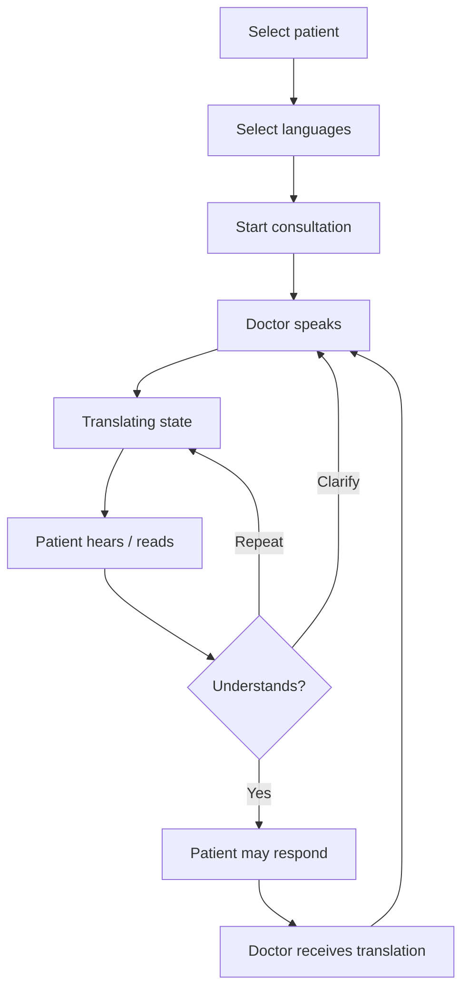

# UX Flow 01 — Consultation loop (single device)

**Device:** One shared tablet  
**Layout:** Dual-pane Doctor | Patient  
**Goal:** Pitch-ready communication experience

## Flow

## Quality bar (every screen)

- [ ] Doctor understands immediately
- [ ] Patient understands immediately
- [ ] Few actions
- [ ] Language distinction obvious
- [ ] Current speaker obvious
- [ ] Translation status obvious
- [ ] 2s translation has a clear waiting state
- [ ] Failure / mic silence / network drop handled
- [ ] Limited digital literacy friendly
- [ ] Not Google Translate with a logo

## Screens

| # | Screen | Primary action |
| --- | --- | --- |
| 1 | Select patient | Tap patient card |
| 2 | Select languages | Pick doctor + patient languages |
| 3 | Consult dual-pane | Speak / Listen / Respond |
| 4 | Confirm strip | Yes / Repeat / Clarify |

## Confirm strip copy

- **Yes** — I understand
- **Repeat** — Say that again
- **Clarify** — Explain more simply
